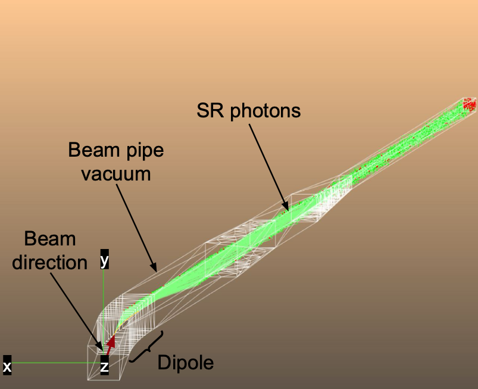

# Synrad+ simulation setup

## Table of Contents
- [Project Description](#project-description)
- [Prerequisites](#prerequisites)
- [Installation](#installation)
- [Usage](#usage)
- [Contributing](#contributing)
- [Contact](#contact)

## Project Description
This project simulates the propagation of synchrotron radiation (SR) emitted by 18-GeV electrons through a vacuum beam pipe using the Synrad+ framework.

Furthermore, there is a code dedicated to analyzing the output data and building histograms with absorbed SR photons on the vacuum beam pipe walls.

## Prerequisites
- **Operating System**: Linux or macOS
- **Synrad+ toolkit**: Version 1.4.34 or later
- **ROOT**: Version 6.24 or later, for the output data storage and analysis 

## Installation

### 1. Clone 
```bash
git clone https://github.com/nat93/SynradBenchmark.git
cd SynradBenchmark/Synrad+/
```

### 2. Install Dependencies
Please ensure that Synrad+, ROOT, and other dependencies are installed on your system.

## Usage

### Running the Simulation
1. Go to `Synrad+/sim`
2. Run the Synrad+ graphic-user interface (GUI)
3. Load the setup file called `simple_spec.syn` or `simple_diff.syn` for specular or diffuse photon reflection study, respectively
4. Run the simulation and collect absorbed photon information into CSV files using the Synrad+ GUI menu: `Tools` - `Particle logger` - `Enable logging` (select the facet and the number of recorded hits)

For more detailes about how to run the simulation, collect data, define surface properties, please refer to [Synrad+ Documentation](https://molflow.web.cern.ch/node/110).

### Geometry modeling

There is a simple 50-m-long vacuum of the beamline pipe. After 5 m of a drift space, there is a 5-m-long uniform dipole field region with 10 mrad of bending radius. A pencil beam of 18 GeV electrons is shot from (0;0;0) towards the positive direction of the Z-axis. SR photons generated in the dipole field are propagated along the vacuum until absorbed. The simulation assumes that the beam pipe wall outside the vacuum is made of copper.



### Running the Analysis
1. After collecting the absorbed SR photon data, go to `Synrad+/ana`
2. Run
```bash
root -l -b -q ana.C   
```
The script read the `Synrad+/ana/fileList.txt` file with the list of output Synrad+ simulation file names, and produces an output ROOT file used by the benchmark.

## Contributing

Contributions are welcome!

## Contact

For any questions or further information, please contact:

- Andrii Natochii - <natochii@bnl.gov>
