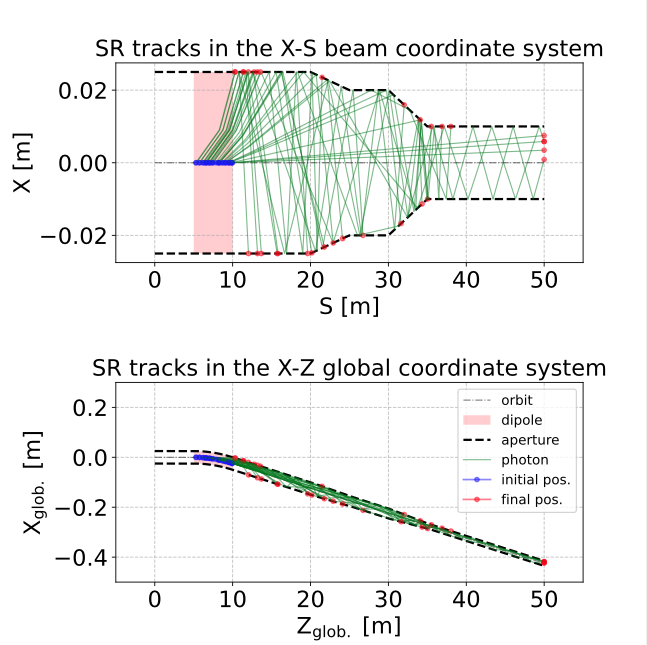

# Synrad3D simulation setup

## Table of Contents
- [Project Description](#project-description)
- [Prerequisites](#prerequisites)
- [Installation](#installation)
- [Usage](#usage)
- [Contributing](#contributing)
- [Contact](#contact)

## Project Description
This project simulates the propagation of synchrotron radiation (SR) emitted by 18-GeV electrons through a vacuum beam pipe using the Synrad3D framework.

Furthermore, there is a code dedicated to analyzing the output data and building histograms with absorbed SR photons on the vacuum beam pipe walls.

## Prerequisites
- **Operating System**: Linux or macOS
- **Bmad toolkit**: Version 1.4.34 or later
- **ROOT**: Version 6.24 or later, for the output data storage and analysis
- **Python**: Version 3.10 or later 

## Installation

### 1. Clone 
```bash
git clone https://github.com/nat93/SynradBenchmark.git
cd SynradBenchmark/Synrad3D/
```

### 2. Install Dependencies
Please ensure that Bmad/Synrad3D, ROOT, and other dependencies are installed on your system.

## Usage

### Running the Simulation
1. Go to `Synrad3D/sim`
2. Load the reflection data tables in `reflectivity/`, read the `README` file there about how to run it
3. Edit the initialization script called `synrad3d_spec.init`, `synrad3d_diff.init`, or `synrad3d_track.init` for specular, diffuse reflection, or SR photon track drawing, respectively.
4. Run
```bash
synrad3d synrad3d_<config>.init
```
where `<config>` is `spec`, `diff`, or `track`. The program reads the initialization file, where the beam pipe wall file name `synrad3d.wall3d` is defined. This files contains the geometry desription.
5. The output files will be stored in the `output_<config>/` directory

For more detailes about how to run the simulation, collect data, define surface properties, please refer to [Synrad3D Documentation](https://www.classe.cornell.edu/bmad/manuals/synrad3d.pdf).

### Running the Analysis
1. After collecting the absorbed SR photon data, go to `Synrad3D/ana`
2. Run
```bash
python ana1.py   
```
to convert the output Synrad3D ASCII file into another ASCII file for further analysis. It is possible to edit the script by uncommenting the corresponding line to draw the SR photon tracks;



```bash
root -l -b -q ana2.C 
```
to convert the new ASCII file into a ROOT file with a ROOT Tree;
```bash
root -l -b -q ana3.C   
```
to produce an output ROOT file used by the benchmark.

## Contributing

Contributions are welcome!

## Contact

For any questions or further information, please contact:

- Andrii Natochii - <natochii@bnl.gov>
